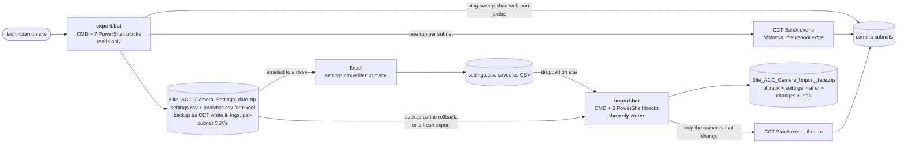
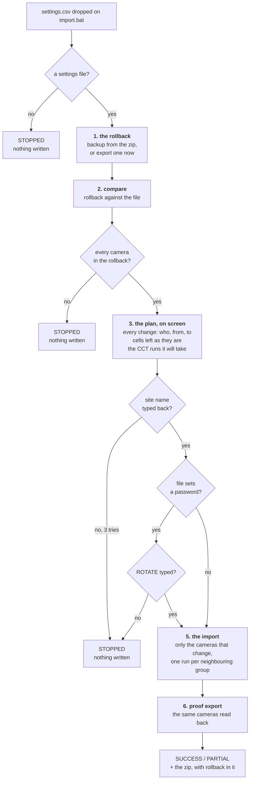

# Camera settings - architecture

How the two scripts are built and why. The README is the user guide; this is for whoever
maintains the tool or has to explain it.

## 1. What it is

Bulk camera configuration through Motorola's Camera Configuration Tool (CCT), without VMS server
access. `CCT-Batch.exe` reaches cameras directly over the network, so a technician with nothing
but this folder and CCT installed can read every camera's settings into a zip, and later write
edited ones back. The editing happens in Excel, on a file the export writes for that purpose.

The users are site technicians. Every message the scripts print has to be actionable by someone
who has never heard of CCT and may be standing in a comms room, which is why the README reads as
it does.

## 2. Two files, and what is inside them

    export.bat     CMD, one file, nothing installed. Only reads.
    import.bat     CMD, one file. The only script that changes a camera.

Each is a batch file with its PowerShell embedded after the final `exit /b`, between marker
pairs like `###PSFORM###` and `###ENDFORM###`, and read out of itself at runtime. That is what
lets exactly one file travel to a site. The blocks:

    export   VT       arms colour and paints the banner
             FORM     the seven-field form, validated as typed
             SWEEP    ping sweep and web-port probe, one run list per /24
             RPT      merges CCT's per-subnet CSVs, writes camera.log
             CSV      the settings-file reader and writer, shared with the import
             COLS     the column table, generated from the Python side
             READABLE writes settings.csv and analytics.csv from CCT's file

    import   VT, FORM, CSV, COLS as above
             PLAN     reads the dropped file in either shape, lists the subnets
             CHECK    the comparison, the plan, the narrowed file, the run lists, the report

`CSV` and `COLS` are the same text in both files, and the checker refuses two copies that
differ. `COLS` is generated from `src\camerasettings\camerasettings_columns.py` by
`scripts\dev\columns_block.py`, never edited by hand.

Why CMD: Motorola's own documentation says PowerShell cannot pass `CCT-Batch` an empty password
or one containing a space, and both are ordinary on a camera fleet. Why one file each: a site
laptop has no Python, no package manager, and often no way to install anything.

## 3. The files a person meets

**CCT's own file** is UTF-16 with a byte-order mark, tab-separated, two rows per camera (a
`Device` row and one `Analytics` row per head), with three quoting styles. Excel breaks it on
save. So the export writes, beside it:

- `settings.csv` - UTF-8 with a byte-order mark, one comma-separated row per camera, CCT's
  column names in CCT's order without CCT's quoting. This is what Excel opens and a person edits.
- `analytics.csv` - one row per camera head: MAC, name, address, head number, then the analytics
  columns with the coded values shown as words (`Outdoor`, `Colour`, `VAL - video analytics`).
- `backup` - CCT's file exactly as it wrote it, with no extension, so a double-click asks what to
  open it with rather than handing it to Excel. It is the record, and the rollback.

The import tells the two shapes apart from the bytes, never the name: a UTF-16 mark and the word
`DeviceHeader` is CCT's file; anything else is read as the readable one, in whatever encoding and
delimiter Excel saved (plain CSV, CSV UTF-8, Unicode Text). Every export made before this
version still imports.

**Excel-proofing.** Only the cells that differ from the rollback are read, and each is normalised
the way a person would expect - `TRUE` is `True`, `1920x1080` is `1920 x 1080`, `h264` is
`H264`, `Outdoor` is `0` - so Excel's own rewrites never show as changes. Identity columns (serial,
firmware, model, date) are ignored whatever Excel did to them. A cell a column cannot read is
left as it is on the camera, named on screen, and the rest of the file goes ahead: nothing
mistyped can reach a camera.

## 4. Import is the only writer

One script writes to cameras, and it is deliberately not the export - one tool that both reads
and writes will eventually be run in the wrong mode on a customer site.

The gates in words, any of them stopping with nothing written:

1. **The rollback.** The export the file came from, handed in as a file (`backup` from the zip,
   offered when it sits beside the dropped file), or a fresh export of every subnet the file
   names. `rollback` in the import zip is a settings file either way: importing it puts the site
   back exactly as it was.
2. **The plan, on screen.** The rollback held against the file: every change as three lines (who,
   from, to), the cells left as they are, and the CCT runs it will take. One y/N question offers
   the change list as a CSV beside the script; it is in the zip either way.
3. **A camera in the file that is not in the rollback is a stop.** With a fresh export that means
   it did not answer; with a file, that it was never there.
4. **The site name, typed back exactly**, three tries.
5. **A second typed word, ROTATE**, when and only when the file sets a password.
6. **A proof export afterwards**, held against what CCT was given: what changed, and anything
   that did not take, named per camera and per setting.

**Only the cameras that change are touched.** The file CCT reads holds just those cameras, each
built from the rollback's own row with only the changed cells applied. The address ranges are
groups of neighbouring changed cameras, split wherever a camera that is not changing sits
between two that are, so no other camera is logged into, let alone written to. The proof export
walks the same ranges, plus any address a camera is moving to.

The evidence for this was the first live import: the whole file was handed to CCT for a whole
subnet, three times, to change two names - 97 cameras written to - and one camera nobody had
asked to change came back with a different NTP mode. Its file said `Manual` with no server, which
the camera cannot hold, and rewriting it exposed that.

## 5. How a range is scanned

CCT-Batch is never given a whole range. Its front end stops waiting for the address walk after
about two minutes and exports whatever has logged in by then, with exit code 0 - about nine
subnets of a wide range, reported as success (read from the tool's own code and reproduced on
loopback). So the export does the finding itself and hands CCT one subnet at a time:

    range typed in the form        10.20.3.1 .................................. 10.20.230.255
                                                    |
    1. ping sweep                  every address, 512 at a time, CCT's own 5 s timeout
                                   about 6,000 addresses a minute
                                                    |
    2. web-port probe              HTTP and HTTPS ports as typed, on what answered ping
                                   a PC or a phone has neither open and drops out here
                                                    |
    3. one CCT run per /24         only subnets holding a candidate; empty ones cost nothing
       that has a candidate        each run well inside CCT's two-minute budget
                                                    |
    4. merge                       subnets\*.csv -> backup, header once, rows in order;
                                   then settings.csv and analytics.csv are written from it

Nothing CCT could have read is lost: CCT itself refuses an address that fails ping and cannot log
in without a web port, so the sweep applies CCT's own two tests earlier and faster. A range wider
than 4,096 addresses shows a time estimate and asks for a Y before starting; wider than 65,536 is
refused in the form as a typo. Should a subnet run ever last 115 s or more it is flagged
INCOMPLETE in camera.log with the two halves to re-run.

Measured at the first live site: 53,247 addresses swept in nine minutes; 90 subnets run in 75
minutes; 635 cameras. A subnet with cameras took about 35 s, a subnet whose web page belonged to
something other than a camera 103 s, and one subnet hit the cut-off because a single address
accepted a connection and never answered - flagged, with its cameras already exported.

**What CCT-Batch does with a range**, read from the decompiled 2.16.0.0: every address is pinged
first with a 5 s timeout; 100 addresses are in flight at once; the batch front end polls the walk
once a second for at most 121 polls and then exports whatever has logged in; an empty range
always costs about 100 s; and with `-f` the exit code is 0 as long as one device logged in, even
when the walk was cut off. `-a` takes one address or a `start-end` pair, never a list - verified
by running the tool, which prints the truth for the installed version.

**Why the administrator prompt exists:** the CCT 2.10.0 release notes list "no longer requires
administrator privileges" as a new feature, so every earlier build does require it - and
unelevated, CCT throws a .NET exception instead of explaining. The scripts relaunch themselves
elevated rather than telling the technician to right-click and start over.

## 6. Reading an exit code

`import.log` inside a zip records the script's own verdict and exit code. For the export: **0**
every subnet that answered was read, **2** nothing answered or no camera logged in, **11** at
least one subnet needs a re-run. For the import: **0** every change in the file is now on the
cameras, **2** nothing needed changing, **3** it stopped at a gate with nothing written, **11**
something did not take. `camera.log` carries CCT's own exit code for each run. Notable CCT codes:

- **6 / 11 - PARTIAL.** Some cameras exported, some not. The CSV is incomplete, and renaming from an
  incomplete export is how half a site gets the wrong names. Re-run before editing anything.
- **2** - no camera answered. For one subnet that usually means the web port belonged to a switch or
  a printer, not a camera; for the whole site, the wrong range, ports or credentials.
- **-532462766** is `0xE0434352`, the .NET unhandled-exception code: CCT crashed rather than
  reporting a problem it understood. Confirmed cause, from a live site: CCT-Batch writes a console
  log into `%LOCALAPPDATA%\Motorola Solutions\Camera Configuration Tool\` and assumes the folder
  exists - the desktop app creates it, the batch tool never does. The scripts create the folder
  before every run. 2.16.0.0 tolerates the missing folder; upgrading is the real fix.

## 7. CCT versions that matter

| Version | Date | Why it matters here |
|---|---|---|
| 1.2.0.4 | Nov 2018 | `CCT-Batch` command line first appears |
| 2.2.14.0 | May 2023 | CSV export of device settings, one row per camera |
| 2.6.0.0 | Jan 2024 | Still requires administrator rights. Crashes if its AppData log folder is missing |
| 2.10.0 | Oct 2024 | Administrator rights no longer required |
| 2.16.0.0 | Jul 2025 | Newest. Tolerates the missing log folder. Flags here were read from this build |

Upgrading a site: go straight to 2.16.0.0.

## 8. Layout, and the one route to "checked"

    export.bat                CMD, one file, nothing installed. Seven embedded PowerShell blocks
    import.bat                CMD, one file, the only script that changes a camera. Six blocks
    README.md                 the user guide
    ARCHITECTURE.md           this file
    pyproject.toml            the Python tooling's configuration
    src\camerasettings\       Python: the reference reading of CCT's file, the column table, and the
                              desk tools (a sheet-driven editor and a compare report for CCT's file)
    scripts\dev\check.cmd     THE check: batch checker, ruff, mypy --strict, every test. Run before done
    scripts\dev\mutate.py     breaks each import gate in turn and proves a test catches it
    scripts\dev\columns_block.py   generates the COLS block in both scripts from the column table
    scripts\dev\venv.cmd      builds the hidden .venv on first run; the pins sit beside it
    tests\check_bat.py        static checks for both scripts - the rules below, the shared blocks, the version
    tests\unit\               the Python modules, including a byte-for-byte round trip of a real export
    tests\integration\        the blocks in isolation, and both scripts driven end to end against a
                              stand-in CCT (and the export once against the real one, on loopback)

The version is the `VERSION=` line near the top of each script, printed in its banner and its
window title, and `__version__` in `camerasettings_main.py`; the checker refuses a mismatch.
**Every commit here is a version bump and is named for it** - `1.0.1`, nothing else - with its
`CHANGELOG.md` entry in the same commit. That file is the only prose the history has.

Export output lands next to the scripts and is git-ignored by name: the CSVs carry camera names,
IP schemes and site layout, and on import can carry credentials. They get emailed; they do not
get committed. No client site is named anywhere in this repository, and the fixtures
use invented camera names and addresses.

The desk tools, from the project folder:

    .venv\Scripts\python src\camerasettings\camerasettings_main.py compare backup edited.csv
    .venv\Scripts\python src\camerasettings\camerasettings_main.py edit backup edits.xlsx

## 9. Design rules

Each of these was a real failure first, found by running the scripts rather than reading them.
`scripts\dev\check.cmd` is the one route to "checked"; `scripts\dev\mutate.py` is the other half:
it breaks each gate in turn and reports MISSED for any that no test catches.

1. **CMD, not PowerShell, for the tools.** Motorola's documentation: PowerShell cannot pass
   `CCT-Batch` an empty password, nor one containing a space. Both are ordinary on camera fleets.
2. **No delayed expansion.** A password containing `!` would be silently mangled, and a mangled
   password looks exactly like an offline camera.
3. **No free-text variable inside a parenthesised line.** The `)` in `Program Files (x86)` - or in
   `Example Club (Stage 2)`, or in an IP typo - closes the block early and CMD dies mid-line.
   Free text reaches PowerShell through the environment, never inside command text.
4. **Every prompt is retry-bounded.** `set /p` returns instantly with no console attached; an
   unbounded ask-again loop once wrote 41MB of repeated prompt text.
5. **Never call `find`.** On a machine with Git Bash or GnuWin32 on the PATH it resolves to the
   Unix `find`, ignores `/c`, and walks the entire drive.
6. **The password is shown as typed and never written to a log, a zip or a report.**
7. **One writer.** The export only reads. The import is the only script that changes a camera,
   and it lives in its own file so the safe tool and the dangerous tool can never be mixed up.
8. **One CCT run per subnet, never one per site.** CCT-Batch's front end gives the address walk
   about two minutes and then exports what it has, exit code 0 (section 5).
9. **`endlocal & exit /b %RC%` on one line.** On its own line, `endlocal` discards RC before
   `exit /b` reads it, and the script returned 0 for every outcome.
10. **Every embedded PowerShell block has a marker pair, and the checker proves it.** A missing or
    doubled marker makes the script execute whatever text lies between.
11. **`mode con` runs with `<nul`.** It reads standard input when input is not a console, so a
    width probe in a script whose input is redirected eats the answers queued behind it.
12. **A PowerShell form that is not the last thing to read input reads it unbuffered.**
    `[Console]::ReadLine()`, and `OpenStandardInput()` with no argument, both fill a 4 KB buffer
    and swallow everything behind the answer. `OpenStandardInput(1)` takes exactly the line.
13. **`set /p` cannot re-read a pipe.** The tests feed answers from a file, which is what a
    console does anyway.
14. **A block shared by both scripts is one block.** `CSV` and `COLS` are the same text in both
    files and the checker refuses drift; `COLS` is generated from the Python column table, never
    edited. Two readers of one file format will disagree the week nobody is looking.
15. **The import touches only the cameras that change.** Proven necessary on the first live run:
    a camera nobody asked to change came back with a different NTP mode after being written to.
16. **One version, in three places, held together by the checker.** A technician reads it off the
    banner; two copies that disagree make that reading a lie.
